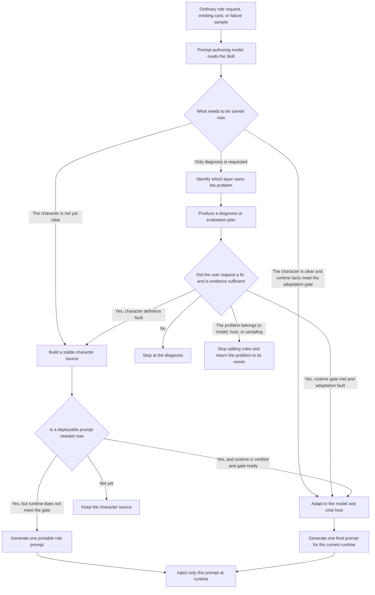
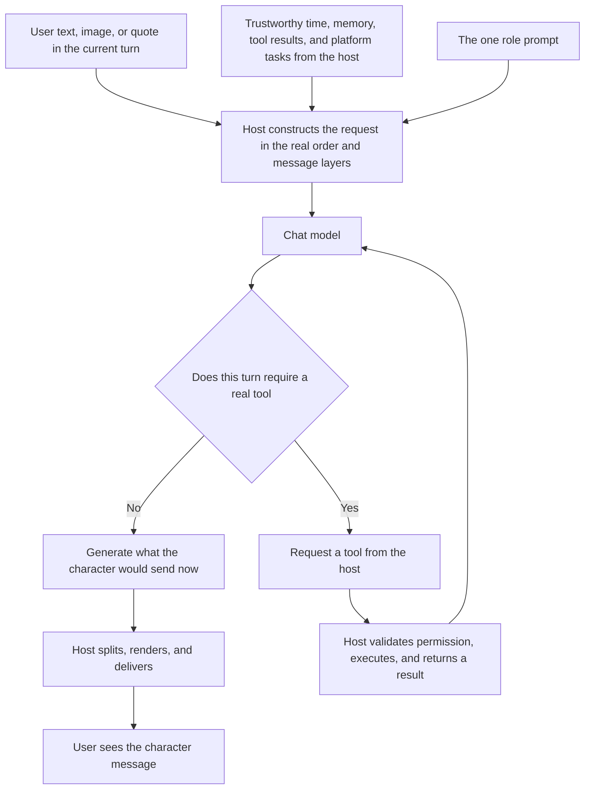

# LLM RP Role Prompt Authoring

[简体中文](README.md) | [English](README.en.md)

> This repository provides a single-file authoring guide (Skill) for the model that writes a role prompt. You describe the character, relationship, and chat environment in ordinary language; the authoring model generates or rewrites one deployable role prompt, which is then given to the model that actually chats with you.

- [Use the Chinese Skill](skills/role-prompt-authoring/role-prompt-authoring-skill.zh-CN.md)
- [Use the English Skill](skills/role-prompt-authoring/role-prompt-authoring-skill.en.md)
- [Browse all documentation](docs/README.md)

Shortest path: give the Skill and an ordinary role request to the prompt-authoring model, take the generated result, and inject only that result into the chat model.

The current public version is **2.0.0-draft.4**, specification revision **2026-09-02.4**. It is a published research draft, not the stable 2.0.0 release, and it does not claim proven improvement across models and platforms.

## Project Scope

Many role cards describe identity, personality, relationship, and speaking style in detail, yet the character still enters a real private chat sounding like scripted dialogue, a task-completing assistant, or a model trying hard to prove that it is role-playing correctly.

This repository studies a narrower problem: with the **model and chat framework held constant**, how can a role prompt preserve the character while reducing unnecessary explanation, summarization, reassurance, questioning, and story progression in one-to-one chat?

Two different model roles matter here:

- The **prompt-authoring model** reads this repository's Skill, understands your request, and writes the deployable role prompt.
- The **chat model** runs that prompt inside QQ, AstrBot, a web chat, or another host and talks with you.

The Skill is for the first model, not the second. At runtime, the chat model receives only the selected deployable role prompt. Research notes, analysis, and authoring records do not travel with it.

## Research Origins

This work continues the public article [Lessons from Writing Persona Prompts for AstrBot](https://github.com/Yuimi-chaya/Yuimi-chaya.github.io/blob/main/src/content/blog/astrbot-roleplay-persona-notes.md) and the early Skill embedded in it. That work focused on making a character definition clear:

- A longer prompt is not automatically better; background detail can dilute the behavior that matters.
- Labels such as “cute,” “gentle,” or “tsundere” do not determine behavior. Causal personality, priorities, contradictions, and defenses matter more.
- Identity, personality, expression, relationship boundaries, situations, tools, and context rules benefit from separate treatment.
- Tools may exist in the background without turning visible character speech into a cold operational report.
- A role card must return to the real platform for controlled testing and small revisions when ambiguity or conflict appears.

Those lessons still hold. Real use later exposed a second problem: **a clearly written character does not automatically behave naturally after entering chat.**

We tried more detailed personas, stricter formatting, explicit bubble rules, and highly capable models. The same patterns kept appearing:

- The user sends a meme, and the character explains it, comments on it, then adds care or advice.
- The user mentions a little research progress, and the character expands it into validation, encouragement, and emotional support.
- The user says they are going to eat, and the character invents “I will wait here for you to come back.”
- The user sends a sticker with no clear proposition, and the character forces it back into an older topic.
- Every turn sounds like a polished line of dialogue instead of something that happened naturally in a chat window.

This is not merely an incomplete persona, and it cannot be fixed by enforcing short replies everywhere.

## Observed Failure Pattern

Modern language models are good at completing tasks. They tend to cover the provided information, demonstrate understanding, produce a complete answer, and make the result helpful, polite, and emotionally appropriate.

That is useful in question answering, writing, and agentic work. In casual private chat, the same tendency can make a character visibly overperform:

1. Restate what the user said to prove it was understood.
2. Explain the meaning to prove deep comprehension.
3. Add evaluation, advice, or reassurance to prove care.
4. End with a question or next step so the turn does not look “wasted.”

The user may only be dropping a sentence, sharing a reaction, or sending a sticker. The model turns it into a miniature deliverable with setup, interpretation, and conclusion.

These outputs do not prove that the model has a literal inner motive, nor do they establish one specific training cause. They do give us a repeatable visible pattern that can be compared and revised.

## Visible-Delivery Bias

This repository uses **Visible-Delivery Bias** for the tendency to expand a reply so the user can see that the model has understood, helped, cared, or successfully performed the role.

The Chinese documentation calls it **展示性交付偏置**. The term describes an observable output tendency, not a proven internal mechanism.

| Current interaction | What the model often adds | A more natural direction |
| --- | --- | --- |
| The user says today's research made a little progress | Restate the progress, praise the effort, warn against self-criticism, and ask about the next step | Receive the point that progress happened; do not automatically build a full care sequence without a relationship-specific reason |
| The user sends an obvious meme | Laugh, translate the image, explain why it is funny, then add commentary | A shared reaction may be enough: surprise, agreement, dislike, or simply a question mark |
| The user says they are going to eat | Add reminders, promise to wait, and assume the conversation will resume immediately | Complete the care that belongs to the present moment without inventing a future obligation |
| The user sends only a sticker | Search for a proposition and restart an older plan or recommendation | Let the sticker function as tone, punctuation, rhythm, presence, or nothing narrative at all |
| The user makes a layered joke | Unpack every layer to prove full understanding | Understanding can remain internal; the visible reply only needs to meet the layer worth answering |

There is no single correct reply in this table, and the short examples are not lines to copy into a role prompt.

The goal is not to make every character terse. The target is the impulse to force a conclusion, reason, or follow-up obligation into the conversation: the model need not explain every layer, answer every information point, or turn every relational hint into an explicit commitment.

A character may still talk at length, comfort seriously, ask questions, or explain a difficult subject. Length is not the criterion. The question is whether the behavior comes from this character, this relationship, and this moment.

## HDSI as a Framework Reference

[HDS Interlude (HDSI)](https://github.com/fy79/HDS) provides a useful public reference: naturalness may depend not only on persona content, but also on **how the whole system shares the work of a conversation**.

HDSI is not the traditional setup where one role prompt goes directly to one model for an immediate reply. Its public design describes several possible layers behind one visible interaction:

1. The host receives messages and handles bursts, interruption, and the current event.
2. The system retrieves trustworthy time, relationship, memory, state, and prior events.
3. A main narrative model considers what has happened and whether the character should reply, remain silent, or delay.
4. Image understanding, memory compression, emotional shifts, or schedule review may be delegated to side models when needed.
5. The host persists state, schedules real actions, and delivers only the content selected for sending.

This does not mean that every turn invokes every model, or that more models automatically produce better role-play. The important point is that **complex understanding, state maintenance, and real actions do not all have to be displayed inside one visible reply**.

The main model may understand a great deal and the system may do a great deal, while the user sees only what the character actually chose to send. This separation of responsibility and visibility is the design idea this project most directly borrows from HDSI's public structure.

## Single-Prompt Adaptation

HDSI requires its own deployment. Layered state, side models, advancing time, silence, delay, proactive messages, and reliable delivery cannot be created by adding a paragraph to a role card.

Many real LLM RP environments still look like this:

> One main chat model + one role prompt + one general-purpose chat host.

This project therefore does not try to reproduce HDSI inside a prompt. It extracts only the ideas that can transfer into prompt authoring:

- Stable character definition and changing conversational state are different kinds of information.
- A user message is first an interaction event, not automatically a plot task.
- Facts, sources, guesses, plans, and unsent thoughts must not collapse into one truth.
- Internal understanding may be rich while the sent message remains limited to the current interaction.
- Time, memory, tools, scheduling, cancellation, rendering, and delivery belong to the real host.
- When a failure belongs to the model or the host, adding more role rules cannot manufacture the missing capability.

The repository compiles these ideas into one role prompt that better fits the known conditions, while leaving the model, host, and available capabilities unchanged.

## Two-Level Prompt Authoring

This two-level view exists only during **prompt authoring**, not during the actual chat. “Role-play within role-play” is simply a metaphor for it.

The prompt-authoring model performs three tasks:

1. Understand why the character thinks this way, what matters to them, and how they relate to the user.
2. Predict how the chat model may misread or overperform the persona: turning closeness into constant caretaking, brevity into fixed one-word replies, tool rules into backend reports, or every instruction into something that must be visibly demonstrated.
3. Rewrite the role prompt so the target model can more easily behave as the character, rather than as an assistant visibly trying to act like the character.

The second layer of modeling ends when authoring ends. The runtime chat model receives only the generated role prompt, not the authoring analysis, prediction process, or evaluation rules.

## Prompt Authoring Workflow

Ordinary users face one entry point. The input may be a one-line request, an existing role card, or a redacted failure sample from real chat.

The four names below only distinguish outputs from the prompt-authoring stage. Ordinary users do not need to memorize them:

| Plain-language name | Internal identifier | Meaning |
| --- | --- | --- |
| Character source | **ROLE_SPEC** | Confirmed personality, relationship, expression, boundaries, and facts that must be preserved |
| Runtime description | **RUNTIME_PROFILE** | Verified model, message layer, injection order, tools, memory, media, and rendering conditions |
| Portable role prompt | **PORTABLE_ROLE_PROMPT** | A single usable prompt produced when runtime facts are incomplete, without pretending to optimize for an unknown platform |
| Final prompt for the current runtime | **FINAL_ROLE_PROMPT** | The one injectable prompt rewritten for verified conditions |

Character definition, runtime adaptation, and diagnosis are called **define**, **compile**, and **audit** in the specification. They are simply names for three kinds of work, not separate steps the user must run and combine manually.

The portable and runtime-specific prompts are mutually exclusive. “Final” only means that runtime uses this one version; it does not mean human validation has passed or that the prompt is universally production-ready.

## Real Chat Message Flow

After authoring, the runtime path should become simple again.

The character source, runtime description, analysis, and evaluation remain in the authoring workspace. The chat model sees only the one deployable role prompt selected for this run, either the portable version or the runtime-specific final version, plus the content that the host actually supplies for this turn.

The model may decide what it wants to say. Text alone cannot guarantee that a tool ran, time passed, a message was delayed, or content was delivered. Those are real host actions.

## Layer Responsibilities

Here, the Host is the program or framework carrying the conversation, such as a web chat, bot framework, AstrBot, or an adapter. It constructs requests, stores state, calls tools, and sends messages.

| Layer | What it actually determines | Common example |
| --- | --- | --- |
| **Model layer** | Whether the model can understand images, memes, ambiguity, long context, and complex instructions, plus the output distribution available to one sample | The same prompt behaves differently across models; a model repeatedly misses implied tone |
| **Prompt layer** | Who the character is, why they interpret events this way, what matters in the relationship, and how they express themselves using information supplied by the host | The character drifts into generic caretaking, explains every meme, or turns each turn into polished dialogue |
| **Host layer** | What the model actually receives, which information is trustworthy, which tools exist, and how memory, splitting, scheduling, and delivery work | Whether current time is real, whether the image is included, whether proactive messaging actually fires, and how bubbles are split |

The layers influence one another, but they cannot impersonate one another:

- If the model cannot understand an image, the Prompt must not pretend it did.
- If the Host did not supply current time, the character must not promote a guess into fact.
- If bubble splitting is poor, fix rendering rather than forcing the model to abandon normal punctuation.
- If the character repeatedly becomes a generic assistant or caretaker, inspect character definition and Prompt adaptation.
- If one sample drifts under otherwise identical conditions, sampling variance may be the honest explanation; one failure should not trigger another page of rules.

This separation is both the starting point of the project and the condition for stopping unproductive prompt edits.

## Usage

The simplest path has three steps:

1. Open the [Chinese Skill](skills/role-prompt-authoring/role-prompt-authoring-skill.zh-CN.md) or [English Skill](skills/role-prompt-authoring/role-prompt-authoring-skill.en.md), and give the full file to a model that will write the prompt.
2. Describe the character, intended platform, relationship, atmosphere, and unwanted behavior in ordinary language.
3. Take the one generated role prompt and place only that result in the role or system prompt position used by the actual chat model.

Your request does not need repository vocabulary. For example:

> Create a role prompt for Yanami Anna in one-to-one QQ chat. There is no plot to advance; the focus is ordinary daily conversation. She can be close and caring, but should not turn every turn into reassurance, summarization, or a companionship task.

If you already have a role card, provide it with the observed failure:

> This is my current role prompt. The model explains memes and expands casual replies into care and advice. Preserve the character, diagnose the problem, and rewrite the prompt.

If exact runtime facts are available, add the model identifier, role-prompt message layer, real injection order, image pipeline, memory, tools, and bubble rendering. If they are not known, the Skill should produce an honest portable prompt instead of inventing platform capabilities.

## Scope and Limits

It can help you:

- Turn vague labels into more stable personality causes, relationship positions, and expressive differences.
- Reconcile conflicting, duplicated, or overly demonstrative rules.
- Rewrite a role prompt for a verified model and host configuration.
- Diagnose visible delivery, unsupported closure, stale-topic absorption, generic caretaking, and backend-report language.
- Return failures to the layer that owns them instead of adding Prompt text forever.

It cannot:

- Add visual understanding, reasoning, long-context stability, or instruction-following ability that the model does not have.
- Add real time, persistent memory, tools, proactive messaging, scheduling, cancellation, or delivery confirmation that the Host does not implement.
- Guarantee every sample or guarantee that all people prefer the same rhythm.
- Reproduce HDSI or any complete multi-model runtime framework with one role prompt.
- Turn a research draft into a production-validated role configuration automatically.

The intended claim is **relative improvement under the same model, Host, and input conditions**, not that prompt writing can exceed the limits of the model and system.

## Provenance and Evidence

The early method is preserved as **Persona Definition v1** in the [historical archive](archive/persona-definition-v1/README.md). It corresponds to the Chinese Skill embedded in the earlier article. The archive records the fixed source commit, file hashes, and the status of the maintained English translation. The full blog article remains in its original blog repository and is not copied into this repository.

HDSI is an independent project. This repository borrows only general ideas from its public design about responsibility, state boundaries, and visible-output selection. It does not copy HDSI code, fixed prompts, fields, JSON contracts, or runtime implementation. See [NOTICE.md](NOTICE.md) and [LICENSE-SCOPE.md](LICENSE-SCOPE.md) for third-party and licensing boundaries.

The research process included unpublished exploratory pairs, real-platform iteration, and human feedback. They are author experience and part of how the method was formed, not effect evidence for the current public version. LLM RP preference depends heavily on character, relationship, model, host, context, and sampling; a heavily targeted test can also mirror the prompt and turn ordinary chat back into a checklist task.

This version therefore publishes the method and its implementation materials, not an effect leaderboard. The repository contains the authoring workflow, bilingual Skills, specifications, historical archives, routing cases, and static validation, but it does not yet provide a public case study or enough effect data to support a cross-model, cross-platform conclusion.

## Documentation

To start immediately:

- [Chinese Role Prompt Authoring Skill](skills/role-prompt-authoring/role-prompt-authoring-skill.zh-CN.md)
- [English Role Prompt Authoring Skill](skills/role-prompt-authoring/role-prompt-authoring-skill.en.md)

To understand the method and its boundaries:

- [Architecture and responsibility](docs/en/architecture.md)
- [Authoring output contracts](docs/en/output-contracts.md)
- [Recording the real runtime](docs/en/runtime-profile.md)
- [Evaluation, attribution, and iteration](docs/en/evaluation-and-triage.md)
- [Migration from earlier methods](docs/en/migration.md)

To inspect provenance and maintenance:

- [Bilingual documentation index](docs/README.md)
- [Historical artifacts and experimental prototypes](archive/README.md)
- [MIT License](LICENSE)
- [License scope](LICENSE-SCOPE.md)
- [Third-party and privacy notice](NOTICE.md)
- [Publication review record](PUBLICATION-REVIEW.md)

Version 2.0.0-draft.4 was published as a research draft on September 2, 2026, under the MIT License. The public repository contains only reviewed methods, Skills, specifications, archives, and validation scripts; it does not contain deployed private role prompts, private chats, screenshots, secrets, accounts, private configuration, or internal test work. Validation checks repository consistency and publication boundaries, not whether a character “feels human,” and historical artifacts should not be loaded together with the current Skill.

## Core Principle

The project is not trying to make every character short, emotionally distant, or dependent on the same set of internet catchphrases. We want the model to understand richly without displaying all of that understanding. A character may care, explain, and talk at length, but those behaviors should come from the person and relationship rather than from an assumption that every turn needs a complete deliverable.

When a failure occurs, return to the simplest three-layer rule:

> The Prompt encodes the character, the Host provides runtime facts and executable capabilities, and the Model sets the limits of understanding and generation.

That distinction tells us when to rewrite the character, when to change the platform, when to switch models or accept sampling variance, and when to stop adding rules.
