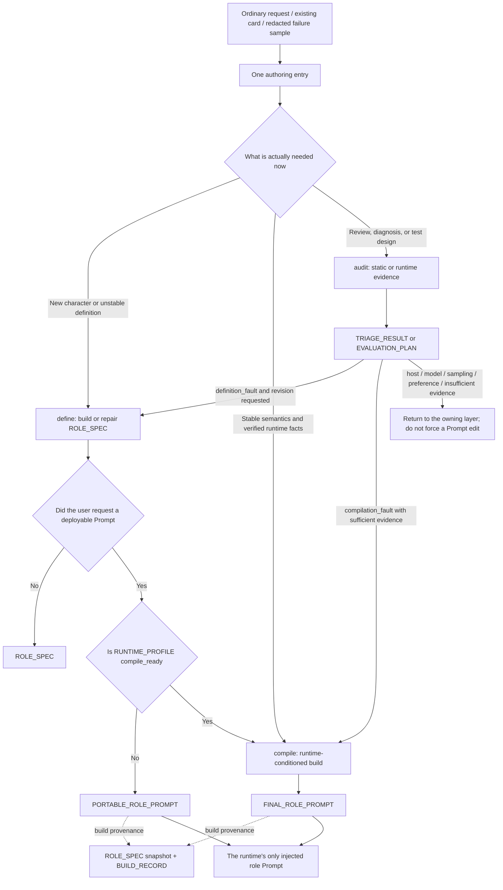
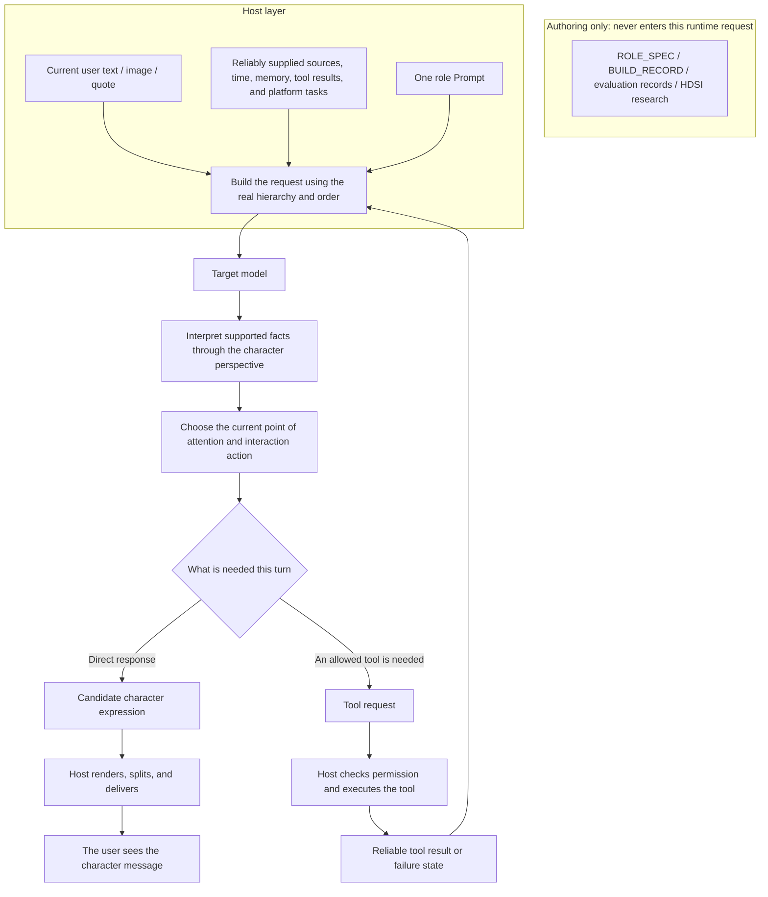

# LLM RP Role Prompt Authoring

> The Prompt encodes the character, the host provides capabilities, and the model sets the ceiling.

[简体中文](README.md) | [English](README.en.md)

> Current status: `2.0.0-draft.4`, specification revision `2026-09-02.4`, `publication_status: published`. This version was published as a public draft on 2026-09-02 and does not claim to be stable `2.0.0`.

This repository defines an authoring method for realistic one-to-one direct-message role Prompts. It starts from a character request an ordinary user could naturally write, builds reusable character semantics, and, when the evidence threshold is met, compiles them for a specific model and host into the runtime's single injectable role Prompt.

The project does not promise to make arbitrary models human, and it does not try to replace real time, memory, tools, state, scheduling, media, cancellation, or delivery with a longer role card. It studies a narrower and more testable question: under the same model, host, and input conditions, how can a Prompt make private chat less like task delivery and more consistently let the character participate from their own perspective, relationship position, and expressive measure?

## Documentation

- Current English Skill: [Direct-Message Role Prompt Authoring Skill](skills/role-prompt-authoring/role-prompt-authoring-skill.en.md)
- Responsibility boundaries: [Architecture](docs/en/architecture.md)
- Authoring file meanings: [Artifact Contracts](docs/en/output-contracts.md)
- Model and host facts: [Runtime Profile](docs/en/runtime-profile.md)
- Diagnosis, testing, and stopping rules: [Evaluation, Triage, And Iteration](docs/en/evaluation-and-triage.md)
- Migration from earlier methods: [Historical Sources And Migration](docs/en/migration.md)
- Bilingual documentation index: [docs/README.md](docs/README.md)
- Provenance, historical artifacts, and prototypes: [archive/README.md](archive/README.md)
- MIT license scope: [LICENSE-SCOPE.md](LICENSE-SCOPE.md)
- Publication gates: [PUBLICATION-REVIEW.md](PUBLICATION-REVIEW.md)

## Start With Three Layers

This boundary is both the starting point of the repository and the stopping condition for revisions.

| Layer | What it determines | What another layer cannot manufacture |
| --- | --- | --- |
| **Model** | Instruction following, multimodal pragmatics, long-context stability, ambiguity handling, and the output-distribution ceiling | A Prompt cannot grant understanding or consistency the model lacks, and it cannot guarantee one sample |
| **Prompt** | Accepted character semantics, relationship position, attention tendencies, interaction measure, visible expression, and interpretation of signals the host reliably provides | A Prompt cannot create source authority, dynamic truth, persistent state, tool results, real time, or delivery guarantees |
| **Host** | Request construction and ownership of sources, current events, time, state, memory, tools, media, scheduling, cancellation, rendering, and delivery | A host cannot replace character design or guarantee that the model will interpret and perform it naturally |

The authoring Skill sits outside these runtime layers. It maintains `ROLE_SPEC`, `RUNTIME_PROFILE`, evidence, and build records, then places only one `PORTABLE_ROLE_PROMPT` or `FINAL_ROLE_PROMPT` into the Prompt layer. Runtime has one injectable Prompt; authoring may keep clearly separated recovery sidecars that are never injected.

## Where The Work Started

The project did not begin in a separate legacy repository. It began with the public Chinese blog article [《给 AstrBot 写人设提示词这件事,我踩过的一些坑》 (“Lessons From Writing Persona Prompts For AstrBot”)](https://github.com/Yuimi-chaya/Yuimi-chaya.github.io/blob/main/src/content/blog/astrbot-roleplay-persona-notes.md) and the persona-authoring Skill embedded in that article. This repository preserves the Chinese Skill body as the standalone historical artifact [Persona Definition v1](archive/persona-definition-v1/README.md); its pinned source revision, file hashes, and the status of the paired English translation are recorded in the archive metadata.

That earlier method described a general role-card editing practice:

- More Prompt text does not necessarily improve a character; background detail can dilute core behavior.
- Neutral labels such as cute, gentle, or tsundere do not determine behavior. Personality needs causes, value ordering, tensions, and defenses.
- Identity, core personality, expression, interaction boundaries, scenarios, tools, formatting, and context boundaries should be managed explicitly.
- Tools are background capabilities; visible replies should remain in character after tool use.
- Role cards should be tested in the real environment under controlled variables, then revised in small steps for ambiguity and conflict.
- Positive examples can become repeated catchphrases; failure structures are often safer than answer keys.

Those ideas remain useful, and Persona Definition v1 remains available as a traceable historical artifact rather than a current entry point. The method put character definition, platform capability, output format, testing, and repair into one document. It helped make a character clearer without fully answering a second question: why can a strong model still look like it is trying too hard to perform, prove itself, and complete every conversational turn after the role card reaches a real chat platform?

## What HDSI Inspired

HDS Interlude (HDSI) demonstrates a different path from making the role card longer. The host owns trustworthy time, current events, state, memory, intent, actions, scheduling, and delivery. The main model decides what the character does now, whether to reply, and what becomes visible only within those constrained facts.

This repository borrows the **separation of responsibilities and visibility**:

- character definition is separate from dynamic state;
- a user message is a current interaction event, not automatically a story task;
- sources, facts, plans, guesses, and unsent content do not collapse into one kind of truth;
- the model may understand a great deal internally while exposing only what the character would actually send now;
- time, silence, delay, proactive sending, tool execution, and successful delivery must be implemented by the host.

This repository does not port HDSI code, fixed Prompts, fields, JSON protocols, stage workflows, or persistent-world simulation, and it does not provide HDSI's runtime guarantees. The scope here is narrower: when the common single-model, single-role-Prompt, general-chat-host setup remains fixed, translate the transferable cognitive boundaries into authoring-time compilation principles.

## The Compile-Time “Performance Inside Performance” Metaphor

This metaphor applies only during authoring. It is not a new identity for the target model.

The authoring model first understands the character, then anticipates how the target model may misread the role card: turning closeness into constant caretaking, brevity into fixed one-word replies, tool rules into backend reports, every meme into an explanation, or rule following into a visible checklist. It then reorders, removes duplication, and rewrites the Prompt as one coherent artifact for that specific model and host.

The second-order modeling ends there. The runtime model sees no actor, director, HDSI fields, rubric, `ROLE_SPEC`, or compilation workflow. It participates in private chat only as the character.

## A Central Problem: Visible-Delivery Bias

Modern LLMs often show a strong tendency to complete and demonstrate a deliverable. That is useful in task work. In casual RP chat, it may become visible proof behavior: to show that it understood, helped, cared, and performed the role, the model appends restatement, explanation, evaluation, advice, reassurance, and a follow-up question, turning a small interaction into a miniature response workflow.

This repository calls the **observable output pattern** visible-delivery bias. “Delivery psychology” is convenient personifying shorthand, not a claim that we have established a literal internal psychology or a specific training cause.

These are failure-shape illustrations, not fixed response templates:

| Current interaction | Common delivery-style expansion | One more natural direction |
| --- | --- | --- |
| The user says their research made a little progress | Restate the progress, praise the effort, then add a complete self-care speech | The character may simply receive the current point and stop |
| The user sends an already obvious meme | Laugh, explain the whole meme, add an opinion, then append care or a question | Shared surprise, agreement, dislike, or even a question mark may be enough |
| The user says they are going to eat | Expand care into an unsupported promise to wait for their return | Complete the immediate care without adding a new relationship obligation |
| The user sends only a sticker | Find a full proposition and an old-topic referent, then restart an earlier plan | Allow it to function as punctuation, tone, rhythm, presence, or no narrative claim at all |

The problem is not simply reply length, and the answer is not universal short replies. The target is **unsupported semantic closure and delivery obligation**: the model need not prove understanding, cover every point, justify every attitude, or translate every sticker into a full proposition. A character can still speak at length, care seriously, explain difficult material, or ask questions when those actions arise from character, relationship, and the current matter rather than a default need to complete an answer.

## How The Skill Works

Ordinary users face one entry. `define`, `compile`, and `audit` are internal routes, not three public Skills to concatenate.



`PORTABLE_ROLE_PROMPT` and `FINAL_ROLE_PROMPT` are mutually exclusive. `FINAL` means the single final artifact of this build for these runtime conditions. It does not mean human-validated or unconditionally production-ready.

When the user asks only for character definition, the route may end at `ROLE_SPEC` without forcing an injectable Prompt build.

## How The Generated Prompt Works At Runtime

The diagram below shows the path visible to the target model. Authoring assets do not enter its context.



Interpret, choose, and generate are not requests for visible analysis or a per-turn state machine. The final Prompt retains only the small number of principles needed for this character, model, and host. Tool execution, delay, bubble splitting, and successful delivery remain host responsibilities.

The authoring-only subgraph intentionally has no edge into the runtime request. The target model receives only the already compiled role Prompt and the content the host actually supplies for that turn.

## Current Entry

- 中文：[role-prompt-authoring-skill.zh-CN.md](skills/role-prompt-authoring/role-prompt-authoring-skill.zh-CN.md)
- English: [role-prompt-authoring-skill.en.md](skills/role-prompt-authoring/role-prompt-authoring-skill.en.md)

Both are standalone authoring Skills that can be provided directly to a Prompt-writing model. They are not Codex installation-format Skills, and they are not second role cards to inject beside the generated Prompt.

| Internal mode | Question | Main artifact |
| --- | --- | --- |
| `define` | Who is the character, and why do they understand, care, and express themselves this way? | `ROLE_SPEC` or an optional `PORTABLE_ROLE_PROMPT` |
| `compile` | How should the character behave more consistently in a model and host that meet the evidence threshold? | `FINAL_ROLE_PROMPT` |
| `audit` | Does a static card or observed failure belong to definition, compilation, host, model, sampling, preference, or insufficient evidence? | `TRIAGE_RESULT` or `EVALUATION_PLAN` |

## Quick Start

1. Choose one language version of the Skill and provide its full text to the model responsible for writing the role Prompt.
2. Describe the character, use case, relationship, traits to preserve, and behavior you dislike in ordinary language.
3. For a conditioned build, provide verifiable facts for the exact model, Prompt message layer, actual injection order, and any tools, memory, media, or rendering behavior that affects compilation.
4. For repair work, provide a redacted real failure sample. For static review only, the existing card is sufficient; do not invent chat evidence.
5. Use one Prompt at runtime. Keep `ROLE_SPEC` snapshots, `BUILD_RECORD`, runtime profiles, and evaluation records on the authoring side.

## Evidence Status And Claim Boundary

The current public tree contains an authoring workflow, bilingual Skills, specification contracts, historical archives, routing cases, and static validation. It does not yet contain a public case study or reproducible effect package, and it does not establish that `draft.4` improves human preference across models and platforms.

A valid comparison fixes the model, provider version, host, message hierarchy, injection order, tools, memory, media pipeline, context, sampling settings, and user input, then changes only the Prompt or authoring method. A report may describe which observable failures increased or decreased under those conditions.

A Prompt can be used to influence behavior probability and reduce conflict, but it cannot manufacture:

- trustworthy source labels, current-event ownership, or persistent state;
- real time, schedules, silence, delay, or proactive sending;
- tool execution, permissions, safety checks, cancellation, retries, or delivery confirmation;
- multi-user isolation, long-term memory management, or persistent-world simulation.

When the failure belongs to the model or host, stop lengthening the Prompt. Changing the model, improving the host, adjusting sampling, or accepting residual variance may be more honest than adding synonymous rules.

## Repository Layout

```text
README.md                 Chinese primary entry
README.en.md              English entry
LICENSE                   MIT License
LICENSE-SCOPE.md          license boundaries for code, documentation, Prompts, and archives
NOTICE.md
PUBLICATION-REVIEW.md
skills/
  role-prompt-authoring/
    role-prompt-authoring-skill.zh-CN.md
    role-prompt-authoring-skill.en.md
docs/
  README.md               bilingual documentation index
  zh-CN/                  current Chinese specifications
  en/                     current English specifications
archive/                  byte-preserved historical methods and prototype
tests/routing-cases.md
scripts/validate-release.ps1
```

The initial publication allowlist excludes real deployment Prompts, private chats, screenshots, internal recovery notes, benchmark work files, credentials, accounts, and private configuration. Historical archives are not current entry points and should not be loaded together with the current Skill.

## Publication And License

This repository uses the [MIT License](LICENSE). It covers code, documentation, Prompts, Skills, tests, translations, and historical archives that the repository owner is authorized to license. Linked content, third-party material such as HDSI, project names, marks, character IP, user material, and content not stored here do not become MIT-licensed merely because they are mentioned. See [LICENSE-SCOPE.md](LICENSE-SCOPE.md) for the exact boundaries.

`2.0.0-draft.4` is an intentionally public research draft, not stable `2.0.0`, and it has no demonstrated cross-model or cross-platform effect guarantee. See [PUBLICATION-REVIEW.md](PUBLICATION-REVIEW.md) for the machine-readable publication record and completed review evidence.

- `scripts/validate-release.ps1 -Mode Draft` checks structure, links, archive hashes, sensitive material, license files, the Git allowlist, and bilingual consistency.
- `scripts/validate-release.ps1 -Mode Release` is the pre-publication gate. It requires `release-ready`, complete license scope, completed reviews, and `published_at: null`.
- `scripts/validate-release.ps1 -Mode Published` is the post-publication audit. It requires `published`, the actual publication date, and no remaining pre-publication wording.

## Final Principle

A role Prompt is not a complete system and should not be forced to pretend that it is one.

The model layer determines what can be understood and performed consistently. The Prompt layer determines whose perspective, relationship, and expressive measure shape the reply. The host layer determines what is actually observed, remembered, executable, and delivered. Keeping those layers distinct tells us where natural behavior came from, where a failure should be fixed, and when Prompt editing should stop.

> The Prompt encodes the character, the host provides capabilities, and the model sets the ceiling.
