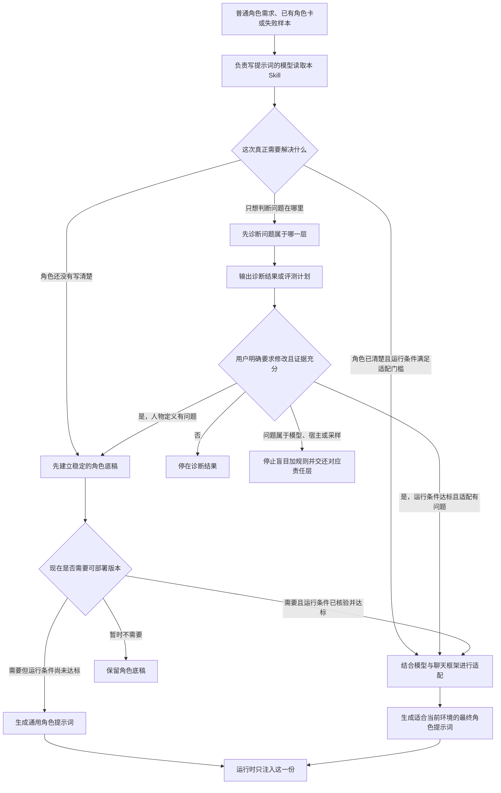
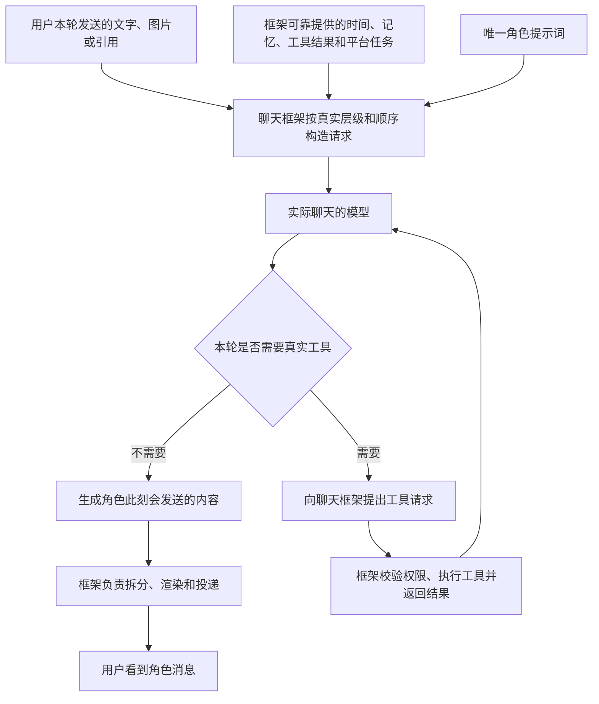

# LLM RP 角色提示词编写

[简体中文](README.md) | [English](README.en.md)

> 这是一个给“负责写角色提示词的模型”使用的单文件说明（Skill）。你用普通语言描述角色、关系和聊天环境，它帮助你生成或重写一份可部署的角色提示词，再交给真正负责聊天的模型。

- [直接使用中文版 Skill](skills/role-prompt-authoring/role-prompt-authoring-skill.zh-CN.md)
- [查看英文版 Skill](skills/role-prompt-authoring/role-prompt-authoring-skill.en.md)
- [阅读完整文档索引](docs/README.md)

最短用法：把 Skill 和普通角色需求交给负责写提示词的模型，取回生成结果，再只把这份结果放进实际聊天模型。

当前公开版本为 **2.0.0-draft.4**，规范修订为 **2026-09-02.4**。它是一份已经公开的研究草案，不是稳定版 2.0.0，也不代表已经获得跨模型、跨平台的效果证明。

## 项目定位

很多角色卡已经把身份、性格、关系和说话方式写得很完整，但角色一进入真实私聊，仍然会像在写台词、完成任务或者努力证明自己“演得很像”。

这个仓库研究的，就是怎样在**模型和聊天框架都不改变**的情况下，把角色提示词写得更适合真实的一对一聊天：保留人物本身，同时减少不必要的解释、总结、安慰、追问和剧情推进。

这里需要先分清两个模型：

- **负责写提示词的模型**读取本仓库的 Skill，理解你的角色需求，并产出最终角色提示词。
- **实际聊天的模型**运行这份最终提示词，在 QQ、AstrBot、网页聊天或其他宿主中与你对话。

本仓库的 Skill 交给前者，不直接交给后者。真正聊天时只注入选定的一份可部署角色提示词，不把研究笔记、分析过程和编写记录一起塞进上下文。

## 研究起点

这项工作延续自公开文章[《给 AstrBot 写人设提示词这件事,我踩过的一些坑》](https://github.com/Yuimi-chaya/Yuimi-chaya.github.io/blob/main/src/content/blog/astrbot-roleplay-persona-notes.md)。那篇文章和其中的早期 Skill 主要解决“怎样把角色写清楚”：

- 提示词不是越长越好，背景越多也可能越容易稀释重点；
- “可爱”“温柔”“傲娇”只是标签，真正影响表现的是人格因果、价值排序、矛盾和防御方式；
- 身份、人格、表达、关系边界、场景、工具和上下文规则需要分开整理；
- 工具可以存在于后台，但不应该把角色的可见表达变成冷冰冰的工作报告；
- 角色卡必须回到真实平台中反复测试，发现歧义和冲突后再小步修改。

这些经验仍然有效。但后来的实际使用暴露了另一个问题：**把角色写清楚，不等于角色进入聊天后就会自然地活出来。**

我们尝试过更详细的人设、更明确的格式、更严格的气泡要求，也用过能力很强的模型。结果仍然经常是：

- 用户随手发一张梗图，角色先解释图片，再发表见解，最后补一句关心；
- 用户只说研究有一点进展，角色立刻扩写成一整套肯定、鼓励和情绪照顾；
- 用户说要去吃饭，角色擅自补出“我会在这里等你回来”；
- 用户发一个没有明确命题的表情包，角色硬把它接回两轮前的话题；
- 每一轮都像一句精心写好的台词，而不像聊天窗口里自然发生的接话。

这不是单纯的“人设不够细”，也不是统一要求短句就能解决的。

## 问题观察

现代语言模型很擅长完成任务。它们通常会努力覆盖用户提供的信息，展示自己已经理解，给出完整回应，并让答案显得有帮助、有礼貌、有共情。

在问答、写作和智能体任务中，这往往是优点。可是在日常私聊里，同一种倾向会让角色显得过于用力：

1. 先复述用户说了什么，证明自己看懂了。
2. 再解释其中的意义，证明自己理解得很深。
3. 接着给出评价、建议或安慰，证明自己有关心。
4. 最后补一个问题或后续安排，证明这一轮没有“白回”。

用户可能只是在丢一句话、发一个表情、共享一个瞬间。模型却把它整理成了一份有开头、有分析、有结论的微型交付物。

我们无法仅凭这些输出断言它内部存在某种真实心理，也不能把原因简单归结为某一种训练方式。但这种输出模式是可以反复观察、比较和修改的。

## 展示性交付偏置

本仓库把这种“为了让用户看见自己已经理解、帮助、关心或成功扮演，而额外展开回复”的现象称为**展示性交付偏置**。

英文规范中使用 **Visible-Delivery Bias** 作为对应名称。这里的“偏置”描述的是可见输出倾向，不是已经证实的模型内部机制。

| 当前互动 | 模型容易追加的内容 | 更自然的方向 |
| --- | --- | --- |
| 用户说今天的研究有一点进展 | 复述进展、肯定努力、提醒别苛刻自己、再追问下一步 | 先接住“有进展”这个落点；没有新的关系理由时，不自动扩写成照顾流程 |
| 用户发一张意思很直观的梗图 | 大笑、翻译整张图、解释为什么好笑、发表见解 | 可以只是“确实”“还真是”“？”或角色自己的一个即时反应 |
| 用户说要去吃饭 | 提醒好好吃、承诺等待、预设回来继续聊天 | 完成当下关心即可，不替双方新增后续义务 |
| 用户只发一个表情包 | 为它寻找明确命题，再把旧话题重新推进 | 允许表情包只是语气、标点、节奏、在场感，甚至没有叙事任务 |
| 用户随口开了一个梗 | 拆解双关和隐含意义，证明自己全部看懂 | 看懂可以留在内部，回复只需要接上其中真正值得回应的一层 |

这里没有唯一标准答案。表格中的短回复也不是要被复制进角色卡的台词模板。

目标更不是把所有角色训练成只会单字回复。真正需要压低的是模型替对话强行补结论、补理由、补后续义务的冲动：它不必解释每一层，不必回应每一个信息点，也不必把一切关系都补成明确承诺。

角色当然可以长聊、认真安慰、主动追问或者详细解释。判断标准不是字数，而是这些内容是否真的来自角色、关系和当前事情。

## HDSI 框架启发

[HDS Interlude（HDSI）](https://github.com/fy79/HDS) 的公开设计提供了一个直观参照：自然感可能不只取决于人设内容，也可能取决于**整个系统怎样分担一次聊天**。

HDSI 不是传统的“一份角色提示词直接交给一个模型，然后立刻生成回复”。从它公开的设计来看，一轮用户可见的聊天背后可以包含多个层次：

1. 宿主先接收消息，处理短时间内连续发送、打断和当前事件。
2. 系统读取可信的时间、关系、记忆、状态和已经发生的事情。
3. 主模型从更完整的视角判断这段时间发生了什么，以及角色此刻是否需要回复。
4. 图片理解、记忆压缩、情绪变化或日程检查等工作，可以在需要时交给其他侧端模型。
5. 最后由宿主保存状态、执行调度，并把真正决定发送的内容投递给用户。

这不表示每一轮都会固定调用所有模型，也不表示模型越多就一定越自然。关键在于：**复杂理解、状态维护和真实动作不必全部挤进一条可见回复里。**

主模型可以理解很多，系统也可以做很多，但用户最终只看到角色此刻真的要说的那一点。职责和可见性的分离，也是本项目从 HDSI 公开结构中重点借鉴的设计思路。

## 单提示词方案

HDSI 需要独立部署。它的分层状态、侧端模型、时间推进、沉默、延迟、主动发送和真实投递，都不是在角色卡里多写几句话就能获得的能力。

而大量现实中的 LLM RP 环境仍然是：

> 一个负责聊天的主模型 + 一份角色提示词 + 一个通用聊天框架。

因此，本项目不尝试在一张提示词里复制 HDSI。我们只提取其中能够迁移到提示词编写阶段的认识：

- 稳定人物设定和不断变化的聊天状态不是同一类信息；
- 用户本轮发来的内容首先是一次互动事件，不自动等于需要完成的剧情任务；
- 事实、来源、猜测、计划和还没有说出口的内容不能混成同一种真相；
- 模型内部可以充分理解，最终发送却只需要满足当前互动；
- 时间、记忆、工具、调度、取消、渲染和投递必须由真实宿主负责；
- 当问题属于模型或宿主时，继续堆叠角色规则不会凭空补出能力。

本仓库做的是：在模型、宿主和可用能力不变时，把这些认识编进一份更适合当前条件的角色提示词。

## 双层编写视角

这套双层视角只发生在**提示词编写阶段**，不发生在实际聊天中。“演中演”只是描述它的一种比喻。

负责写提示词的模型需要做三件事：

1. 先理解这个角色为什么这样想、在意什么、怎样与用户相处。
2. 再预判真正聊天的模型可能怎样误解这份人设，例如把亲近写成持续照顾，把简短写成固定单字，把工具规则写成后台报告，或者为了证明遵守规则而逐项表演。
3. 最后重新组织整份角色提示词，让目标模型更容易表现成角色自己，而不是表现成“一个正在努力演角色的助手”。

第二层建模在编写完成时就结束了。真正聊天的模型只接收生成的角色提示词，不接收编写阶段的分析、预测过程或评价规则。

## 提示词生成流程

普通用户只需要面对一个入口。你可以提供一句角色需求、已有角色卡，或者经过脱敏的真实失败样本。

下面四个名称只用于区分提示词编写阶段的不同产物。普通使用者不需要先记住它们：

| 人话名称 | 仓库内部名称 | 含义 |
| --- | --- | --- |
| 角色底稿 | **ROLE_SPEC** | 保存已经确认的人格、关系、表达、边界和不可随意改写的设定 |
| 运行环境说明 | **RUNTIME_PROFILE** | 记录模型、消息层级、注入顺序、工具、记忆、媒体和渲染等可验证条件 |
| 通用角色提示词 | **PORTABLE_ROLE_PROMPT** | 环境信息不足时生成的单一可用版本，不假装已经针对未知平台优化 |
| 当前环境的最终提示词 | **FINAL_ROLE_PROMPT** | 已根据可信运行条件重新编写的唯一注入版本 |

建立角色、适配环境和排查问题在规范中分别称为 **define**、**compile** 和 **audit**。它们只是三类工作的名称，不需要用户手工逐项执行或合并结果。

通用版本和当前环境的最终版本不会同时注入。这里的“最终”只表示实际运行时只使用这一个版本，不表示它已经通过真人验收或能够无条件投入生产。

## 实际聊天路径

编写阶段结束后，真实聊天路径应该重新变得简单。

角色底稿、运行环境说明、分析记录和测试结论都留在编写阶段。实际聊天模型只看到本次选定的一份可部署角色提示词，也就是通用版或当前环境最终版，以及宿主在本轮真实提供的内容。

模型可以决定“想说什么”，但不能靠文字保证工具已经执行、时间已经过去、消息已经延迟或者某条内容已经成功送达。这些都是宿主的真实动作。

## 三层职责

这里的“宿主”指承载聊天的程序或框架，例如网页聊天应用、机器人框架、AstrBot 及其适配器。它负责构造请求、保存状态、调用工具和发送消息。

| 层级 | 它真正决定的事情 | 常见例子 |
| --- | --- | --- |
| **模型层** | 模型能否理解图片、梗、歧义、长上下文和复杂指令，以及一次采样可能生成什么 | 同一份角色提示词在不同模型上表现不同；某些模型始终抓不住隐含语气 |
| **Prompt 层** | 角色是谁、为什么这样理解、在关系中在意什么、怎样表达和怎样面对宿主提供的信息 | 角色是否滑向通用照顾者，是否习惯解释梗图，是否把每轮都说成完整台词 |
| **宿主层** | 模型本轮实际看见什么、哪些信息可信、能调用什么工具、怎样记忆、拆分、调度和投递 | 当前时间是否真实，图片是否传入，主动消息是否真的触发，气泡怎样分段 |

三层会互相影响，但不能互相冒充：

- 模型看不懂图片，不应靠提示词假装它已经看懂；
- 宿主没有提供当前时间，角色不应自行把猜测写成事实；
- 气泡拆分规则不合理，应修改渲染逻辑，而不是逼模型放弃正常标点；
- 角色持续表现成通用客服或照顾者，才需要回头检查角色定义和提示词适配；
- 同一条件下偶尔出现一次偏离，可能只是采样差异，不能看到一次失败就继续加长规则。

这套区分既是项目的起点，也是停止无效修改的条件。

## 使用方法

最简单的用法只有三步：

1. 打开[中文版 Skill](skills/role-prompt-authoring/role-prompt-authoring-skill.zh-CN.md)，把全文交给一个负责写提示词的模型。
2. 用普通语言告诉它你想要什么角色、用在哪里、你们是什么关系，以及哪些表现让你觉得别扭。
3. 取回它生成的那一份角色提示词，只把这份结果放进实际聊天模型的角色或系统提示位置。

你的请求可以像普通用户说话，不需要先学习本仓库的术语。例如：

> 帮我生成一份用于 QQ 一对一私聊的八奈见杏菜角色提示词。没有需要推进的剧情，重点是日常聊天。她可以亲近和关心我，但不要每轮都像在安慰、总结或完成陪伴任务。

如果你已经有角色卡，可以直接提供原文并说明真实问题：

> 这是我现在使用的角色提示词。模型看到梗图时总会解释一遍，还经常把普通接话扩写成关怀和建议。请保留角色本身，帮我判断问题并重写。

如果你知道准确的模型和平台条件，也可以继续提供模型型号、角色提示词所在的消息层级、实际注入顺序、图片链路、记忆、工具和气泡渲染方式。信息不足时，Skill 应生成诚实的通用版本，而不是编造平台能力。

## 能力边界

它可以帮助你：

- 从模糊标签中提炼更稳定的人格因果、关系位置和表达差异；
- 整理冲突、重复和会诱发逐项表演的规则；
- 针对已经确认的模型与平台条件重新编写角色提示词；
- 诊断展示性交付、无依据语义闭合、旧话题吸附、通用照顾者和工具报告腔；
- 把问题交还给真正负责的层级，避免每次失败都继续堆 Prompt。

它不能：

- 给模型增加原本没有的视觉、推理、长上下文或指令遵循能力；
- 给宿主增加真实时间、持久记忆、工具、主动消息、调度、取消或投递确认；
- 保证每次采样都稳定，也不能保证所有人都更喜欢同一种聊天节奏；
- 用一份角色提示词复现 HDSI 或任何完整的多模型运行框架；
- 把研究草案自动变成已经通过生产验收的角色配置。

我们追求的是**同一模型、同一宿主、相同输入条件下的相对改善**，不是宣称提示词可以跨越模型和系统本身的上限。

## 来源与证据

早期方法现以 **Persona Definition v1** 的名字保存在[历史归档](archive/persona-definition-v1/README.md)中。它对应上一篇文章中内嵌的中文 Skill；归档说明记录了固定来源提交、文件哈希以及英文配套译本的性质。完整博客文章仍由原博客仓库维护，本仓库不复制整篇文章。

HDSI 是独立项目。本仓库只借鉴其公开设计中关于职责划分、状态边界和可见输出选择的思想，没有复制它的代码、固定提示词、字段、JSON 协议或运行实现。第三方与许可边界见 [NOTICE.md](NOTICE.md) 和 [LICENSE-SCOPE.md](LICENSE-SCOPE.md)。

研究过程中做过未公开的探索性配对、真实平台迭代和真人反馈，但它们属于作者经验和方法形成过程，不作为当前公开版本的效果证据。LLM RP 的偏好高度依赖角色、关系、模型、宿主、上下文和采样；过度定向的测试还可能根据提示词“出题”，把日常聊天重新变成检查点任务。

因此，本版本公开的是方法和实现材料，而不是效果排行榜。仓库包含作者工作流、双语 Skill、规范、历史归档、路由用例和静态校验，但尚未提供公开案例研究或足以支持跨模型、跨平台结论的效果数据。

## 文档导航

想直接开始：

- [中文版 Role Prompt Authoring Skill](skills/role-prompt-authoring/role-prompt-authoring-skill.zh-CN.md)
- [English Role Prompt Authoring Skill](skills/role-prompt-authoring/role-prompt-authoring-skill.en.md)

想理解方法和边界：

- [架构与职责](docs/zh-CN/architecture.md)
- [作者侧产物分别是什么](docs/zh-CN/output-contracts.md)
- [怎样记录真实运行环境](docs/zh-CN/runtime-profile.md)
- [怎样测试、归因并决定是否继续修改](docs/zh-CN/evaluation-and-triage.md)
- [怎样从早期方法迁移](docs/zh-CN/migration.md)

想查看来源和维护信息：

- [中英文文档总索引](docs/README.md)
- [历史原件与实验原型](archive/README.md)
- [MIT License](LICENSE)
- [许可适用范围](LICENSE-SCOPE.md)
- [第三方与隐私说明](NOTICE.md)
- [公开发布审查记录](PUBLICATION-REVIEW.md)

2.0.0-draft.4 于 2026-09-02 作为研究草案公开，并采用 MIT License。公开仓库只包含经过审查的方法、Skill、规范、归档和校验脚本，不包含真实部署角色提示词、私人聊天、截图、密钥、账号、私有配置或内部测试工作文件。校验脚本只检查仓库的一致性与发布边界，不评价角色是否“像真人”；历史归档也不应和当前 Skill 一起加载。

## 核心原则

这个项目不追求让所有角色都变短、变冷淡或使用相同网络口癖。模型可以在内部充分理解，却不必把全部理解都展示出来；角色可以关心、解释和长聊，但这些行为应来自人物和关系，而不是来自“这一轮必须交付完整”的惯性。

判断一次失败该改哪里，仍然回到最简单的三层：

> 角色由提示词编码，运行事实与可调用能力由宿主提供，理解与生成上限由模型决定。

分清这三层，才能知道什么时候该重写角色，什么时候该调整平台，什么时候应该换模型或接受采样差异，也才能知道什么时候该停止继续增加规则。
