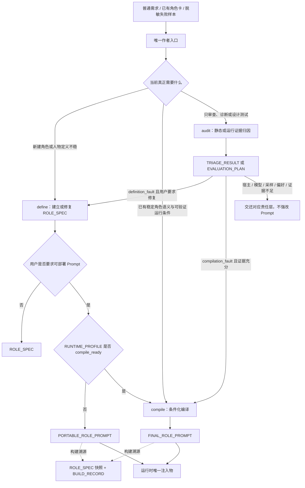
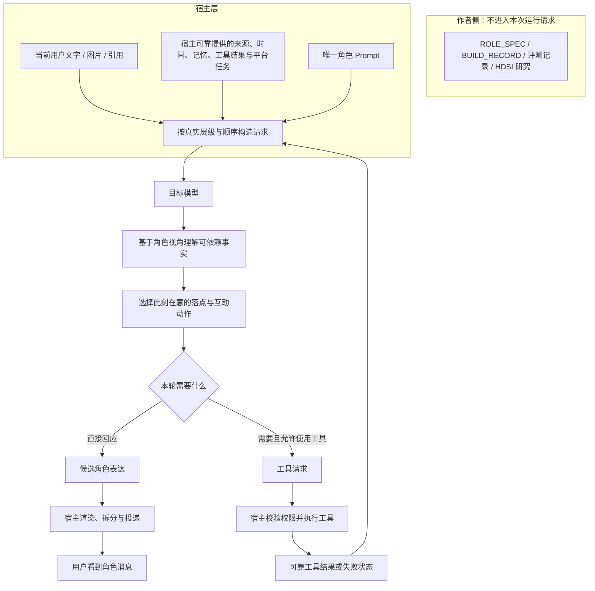

# LLM RP 角色提示词作者工程

> 角色由 Prompt 编码，能力由宿主提供，上限由模型决定。

[简体中文](README.md) | [English](README.en.md)

> 当前状态：`2.0.0-draft.4`，规范修订 `2026-09-02.4`，`publication_status: published`。本版本于 2026-09-02 作为公开草案发布，不冒充稳定版 `2.0.0`。

这是一个面向现实一对一私聊的角色 Prompt 作者侧方法。它从普通用户能够自然说出的角色需求出发，先建立可复用的角色语义，再在证据充分时结合目标模型与宿主条件，生成运行时唯一可注入的角色 Prompt。

本仓库不承诺让任意模型“变成真人”，也不尝试用一张更长的角色卡替代真实时间、记忆、工具、状态、调度、媒体、取消与投递。它研究的是更有限也更可验证的问题：在同一模型、同一宿主和相同输入条件下，怎样让 Prompt 更少把私聊变成任务交付，更稳定地让角色以自己的视角、关系位置和表达分寸参与对话。

## 文档导航

- 当前中文 Skill：[现实私聊角色 Prompt 作者 Skill](skills/role-prompt-authoring/role-prompt-authoring-skill.zh-CN.md)
- 快速了解职责边界：[架构与职责](docs/zh-CN/architecture.md)
- 查看作者侧文件含义：[产物契约](docs/zh-CN/output-contracts.md)
- 记录真实模型与平台条件：[运行条件档案](docs/zh-CN/runtime-profile.md)
- 诊断、测试和停止加规则：[评测、归因与迭代](docs/zh-CN/evaluation-and-triage.md)
- 从早期方法迁移：[历史来源与方法迁移](docs/zh-CN/migration.md)
- 中英文文档总索引：[docs/README.md](docs/README.md)
- 来源、历史原件与实验原型（双语索引）：[archive/README.md](archive/README.md)
- MIT 许可适用范围：[LICENSE-SCOPE.md](LICENSE-SCOPE.md)
- 当前发布门禁（机器可读英文记录）：[PUBLICATION-REVIEW.md](PUBLICATION-REVIEW.md)

## 先分清三层

这条边界既是本仓库的起点，也是所有修改的停止条件。

| 层级 | 决定什么 | 不能被另一层凭空补出来的东西 |
| --- | --- | --- |
| **模型层** | 指令遵循、多模态语用、长上下文稳定性、歧义处理和输出分布上限 | Prompt 不能让模型获得其无法理解或稳定遵守的能力，也不能保证某一次采样 |
| **Prompt 层** | 编码已接受的角色语义、关系位置、注意倾向、互动分寸、可见表达，以及如何解释宿主已可靠提供的信号 | Prompt 不能创造可信来源、动态事实、持久状态、工具结果、真实时间或投递保证 |
| **宿主层** | 构造请求并持有来源、当前事件、时间、状态、记忆、工具、媒体、调度、取消、渲染和投递 | 宿主不能替代角色设计，也不能保证模型一定理解并演绎得自然 |

作者 Skill 位于这三层运行时之外。它维护 `ROLE_SPEC`、`RUNTIME_PROFILE`、证据与构建记录，最终只把一份 `PORTABLE_ROLE_PROMPT` 或 `FINAL_ROLE_PROMPT` 交给 Prompt 层。运行时只有一个可注入 Prompt；作者侧可以另有明确隔离、绝不注入的恢复附件。

## 我们从哪里开始

本项目的前身不是另一个独立的旧版仓库，而是公开博客文章[《给 AstrBot 写人设提示词这件事,我踩过的一些坑》](https://github.com/Yuimi-chaya/Yuimi-chaya.github.io/blob/main/src/content/blog/astrbot-roleplay-persona-notes.md)及其中内嵌的角色卡作者 Skill。本仓库把那份中文 Skill 正文独立冻结为[早期角色定义方法 Persona Definition v1](archive/persona-definition-v1/README.md)；固定来源版本、文件哈希以及英文配套译本的性质都记录在归档说明中。

这套早期方法讨论的是一组泛化角色卡编辑经验：

- 提示词变长不一定让角色更好，背景信息可能稀释核心行为；
- “可爱”“温柔”“傲娇”这类中性标签不足以决定实际表现，需要写清人格因果、价值排序、矛盾和防御方式；
- 角色身份、核心人格、表达、互动边界、场景、工具、格式和上下文边界应分块管理；
- 工具是后台能力，使用工具后仍应保持角色的可见语气；
- 角色卡需要在真实环境中做控制变量测试，再根据描述歧义和规则冲突小步修改；
- 正例容易变成被复读的固定台词，失败结构往往比标准答案更适合长期迭代。

这些观点仍然有效，Persona Definition v1 也继续作为可追溯的历史原件保留，但不再是当前入口。它把人物定义、平台能力、输出格式、测试和返工都放进一份方法里，能帮助“把角色写清楚”，却没有充分回答另一个问题：当角色卡进入真实聊天平台后，为什么一个已经很强的模型仍会显得像在努力扮演、努力证明、努力把每轮说完整？

## HDSI 带来的启发

HDS Interlude（HDSI）展示了一条与“继续加长角色卡”不同的路线：可信时间、当前事件、状态、记忆、意图、动作、调度和投递由宿主持有，主模型只在受约束的事实范围内决定角色这一刻会做什么、是否回复以及什么内容真正可见。

我们借鉴的是这种**职责划分与可见性分离**：

- 角色定义与动态状态分开；
- 用户消息只是当前互动事件，不自动成为剧情任务；
- 来源、事实、计划、猜测和未说出口的内容不能混成同一种真相；
- 模型内部可以理解很多，但用户最终只需要看到角色此刻真正会发送的内容；
- 时间、沉默、延迟、主动发送、工具执行和投递成功必须由宿主真实实现。

本仓库没有移植 HDSI 的代码、固定 Prompt、字段、JSON 协议、阶段流程或持续世界模拟，也不提供它的运行时保证。这里做的是更窄的蒸馏：在主流“单模型 + 单角色 Prompt + 通用聊天宿主”条件不变时，把其中可迁移的认知边界转写成作者侧编译原则。

## 编译期的“演中演”

“演中演”只是作者阶段的隐喻，不是目标模型的新身份。

作者模型先理解角色，再预判目标模型可能怎样误读这份角色卡：它会不会把亲近写成持续照顾，把简短写成固定单字，把工具规则写成后台报告，把每个梗都解释一遍，或者为了证明遵守规则而逐项兑现。作者模型据此重新排序、删重和统一改写，让最终 Prompt 更适合那个确定的模型与宿主。

第二层建模到此结束。运行模型看不到“演员”“导演”、HDSI 字段、评分标准、`ROLE_SPEC` 或编译流程；它只以角色本人参加私聊。

## 一个核心问题：展示性交付偏置

现代 LLM 经常表现出很强的“把事情交付完整”的倾向。面对任务时，这是优点；进入日常 RP 私聊后，它可能变成一种可见的证明行为：为了证明自己看懂了、有帮助、有关心、会扮演，模型追加复述、解释、评价、建议、安慰和追问，把一次普通接话扩写成小型答复流程。

本仓库把这种**可观察的输出模式**称为“展示性交付偏置”。“交付心理”是便于讨论的拟人化叫法，不代表我们已经证明了模型内部心理或具体训练因果。

下面只是失败结构示意，不是固定回复模板：

| 当前互动 | 容易出现的交付式展开 | 更自然的方向之一 |
| --- | --- | --- |
| 用户说今天的研究有一点进展 | 复述进展，肯定努力，再补“忙了一天已经不错了，别太苛刻自己” | 角色只接住当前落点，不把普通进展扩写成完整安慰流程 |
| 用户发一张已经很直观的梗图 | 先大笑，再完整解释梗图含义，发表见解，最后补关怀或问题 | 共享感觉即可，例如意外、认同、嫌弃或一个问号 |
| 用户说要去吃东西 | 把关心扩写成“我会在这里等你回来”，无依据新增后续陪伴承诺 | 只完成当下关心，不替关系追加新义务 |
| 用户只发一个表情包 | 为它寻找明确命题和旧话题对象，再重新推进之前的建议或计划 | 允许它只是标点、语气、节奏、在场感，甚至不承担叙事 |

问题不等于“回复太长”，解决办法也不是统一短答。真正要压低的是**无依据的语义闭合与交付义务**：不必证明看懂，不必覆盖所有信息点，不必为每个态度补理由，也不必把一个表情包翻译成完整命题。角色仍然可以长聊、认真关心、解释复杂问题或主动追问，只要这些行为来自人物、关系和当前事情，而不是来自模型对完整答复的默认冲动。

## Skill 怎样工作

普通用户只面对一个入口。`define`、`compile` 和 `audit` 是内部路由，不是三份需要手工拼接的 Skill。



`PORTABLE_ROLE_PROMPT` 和 `FINAL_ROLE_PROMPT` 互斥。`FINAL` 只表示它是本次、该运行条件下的唯一最终构建物，不表示已经经过真人验收或可以无条件投入生产。

用户只要求人物定义时，流程可以在 `ROLE_SPEC` 结束，不会被强制生成可注入 Prompt。

## 生成的 Prompt 在真实环境中怎样工作

下面是目标模型能够感知到的路径。作者侧资产不会一起进入模型上下文。



图中的“理解、选择、生成”不是要求目标模型输出分析过程，也不是逐轮状态机。最终 Prompt 只保留当前角色、模型和宿主真正需要的少量原则。工具是否执行、消息是否延迟、气泡如何拆分、是否成功投递，始终由宿主决定。

作者侧子图故意没有通向运行请求的连线。进入目标模型上下文的只有已经编译完成的唯一角色 Prompt，以及宿主本轮实际提供的内容。

## 当前入口

- 中文：[role-prompt-authoring-skill.zh-CN.md](skills/role-prompt-authoring/role-prompt-authoring-skill.zh-CN.md)
- English: [role-prompt-authoring-skill.en.md](skills/role-prompt-authoring/role-prompt-authoring-skill.en.md)

两者都是可直接提供给提示词编写模型的**单文件作者 Skill**。它们不是 Codex 安装目录格式，也不是要和角色 Prompt 一起注入目标聊天模型的第二张角色卡。

| 内部模式 | 解决的问题 | 主要产物 |
| --- | --- | --- |
| `define` | 角色是谁，为什么这样理解、在意和表达 | `ROLE_SPEC` 或按需生成的 `PORTABLE_ROLE_PROMPT` |
| `compile` | 在满足证据门槛的模型与宿主中怎样更稳定地表现成自己 | `FINAL_ROLE_PROMPT` |
| `audit` | 静态卡片或真人失败属于定义、编译、宿主、模型、采样、偏好还是证据不足 | `TRIAGE_RESULT` 或 `EVALUATION_PLAN` |

## 快速使用

1. 选择中文或英文 Skill，把全文提供给负责写 Prompt 的模型。
2. 用普通语言描述角色、用途、关系、希望保留的气质和讨厌的表现。
3. 若要得到条件化版本，提供可验证的模型精确型号、Prompt 消息层级、实际注入顺序，以及会影响编译的工具、记忆、媒体与渲染条件。
4. 若正在返工，提供脱敏的真实失败样本；只要求静态审查时，提供当前角色卡即可，不需要伪造聊天证据。
5. 运行时只使用一个 Prompt。`ROLE_SPEC` 快照、`BUILD_RECORD`、运行档案和验收记录都保留在作者侧，不注入目标模型。

## 证据状态与效果边界

当前公开树提供的是作者工作流、双语 Skill、规范合同、历史归档、路由用例与静态校验。它尚未包含公开 case study 或可复现效果数据，也没有证明 `draft.4` 能跨模型、跨平台稳定改善真人偏好。

有效比较必须固定模型、提供商版本、宿主、消息层级、注入顺序、工具、记忆、媒体链路、上下文、采样参数和用户输入，只改变 Prompt 或编译方法。报告只能说明在这些条件下，哪些可观察失败增加或减少。

Prompt 可以用于影响行为概率与降低冲突，但不能凭空提供：

- 可信来源标签、当前事件所有权和持久状态；
- 真实时间、日程、沉默、延迟和主动发送；
- 工具执行、权限、安全校验、取消、重试和投递确认；
- 多用户隔离、长期记忆管理和持续世界模拟。

当失败属于模型能力或宿主缺口时，停止继续加长 Prompt。换模型、改宿主、调整采样或接受剩余方差，都是比堆叠同义规则更诚实的结论。

## 仓库结构

```text
README.md                 中文主入口
README.en.md              English entry
LICENSE                   MIT License
LICENSE-SCOPE.md          代码、文档、Prompt 与归档的许可边界
NOTICE.md
PUBLICATION-REVIEW.md
skills/
  role-prompt-authoring/
    role-prompt-authoring-skill.zh-CN.md
    role-prompt-authoring-skill.en.md
docs/
  README.md               双语文档索引
  zh-CN/                  中文现行规范
  en/                     English current specifications
archive/                  原字节历史方法与实验原型
tests/routing-cases.md
scripts/validate-release.ps1
```

首发白名单不包含真实部署 Prompt、真人聊天、截图、内部恢复笔记、benchmark 工作文件、密钥、账号或私有配置。历史归档不是当前入口，也不应和当前 Skill 同时加载。

## 发布状态与许可证

本仓库采用 [MIT License](LICENSE)。它覆盖本仓库所有者有权授权的代码、文档、Prompt、Skill、测试、译本与历史归档；外链内容、HDSI 等第三方材料、项目名称、商标、角色 IP、用户材料和未入库内容不因被提及而自动获得 MIT 授权。详细边界见 [LICENSE-SCOPE.md](LICENSE-SCOPE.md)。

`2.0.0-draft.4` 是有意公开的研究草案，不是稳定版 `2.0.0`，也没有获得跨模型、跨平台效果证明。机器可读发布记录与已完成审查见 [PUBLICATION-REVIEW.md](PUBLICATION-REVIEW.md)。

- `scripts/validate-release.ps1 -Mode Draft`：检查结构、链接、归档哈希、敏感信息、许可文件、Git 白名单和双语一致性。
- `scripts/validate-release.ps1 -Mode Release`：发布前门禁，要求状态为 `release-ready`、许可证与许可范围齐全、全部复核完成，同时保持 `published_at: null`。
- `scripts/validate-release.ps1 -Mode Published`：真实发布后的审计，要求状态为 `published`、记录实际发布日期，并清除对外文档中的预发布措辞。

## 最后的原则

角色 Prompt 不是完整系统，也不该被迫假装成完整系统。

模型层决定它能理解和稳定做到什么；Prompt 层决定它以谁的视角、关系和分寸表达；宿主层决定它实际看见什么、记得什么、能做什么以及什么内容真的被送达。分清这三层，才能知道一次自然来自哪里、一次失败该改哪里，以及什么时候应该停止继续写 Prompt。

> 角色由 Prompt 编码，能力由宿主提供，上限由模型决定。
